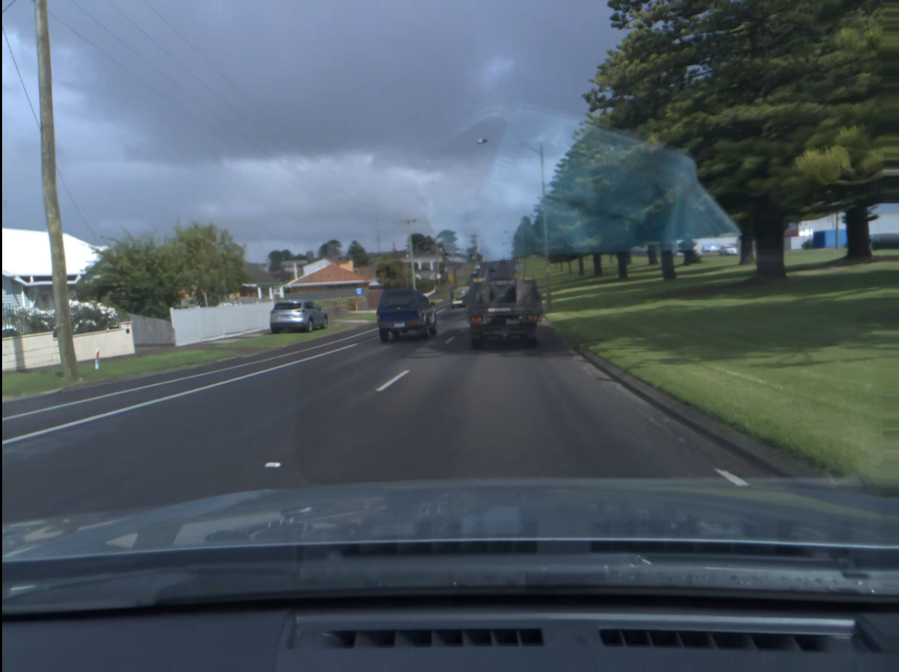
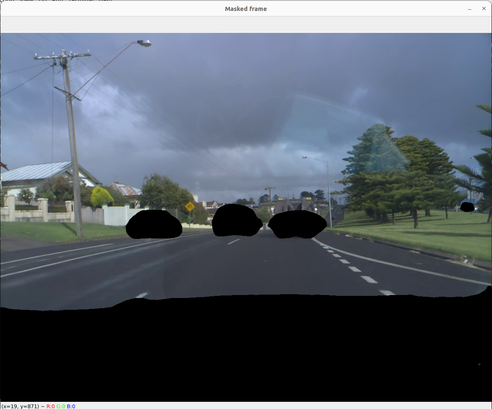
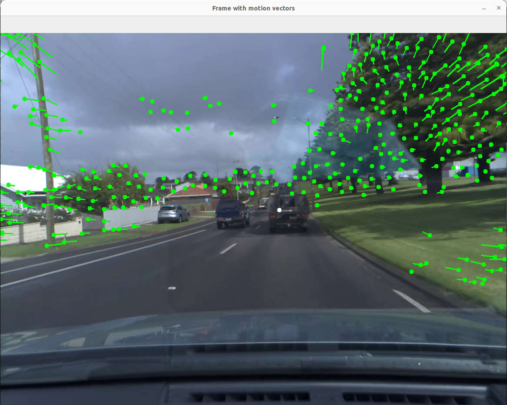
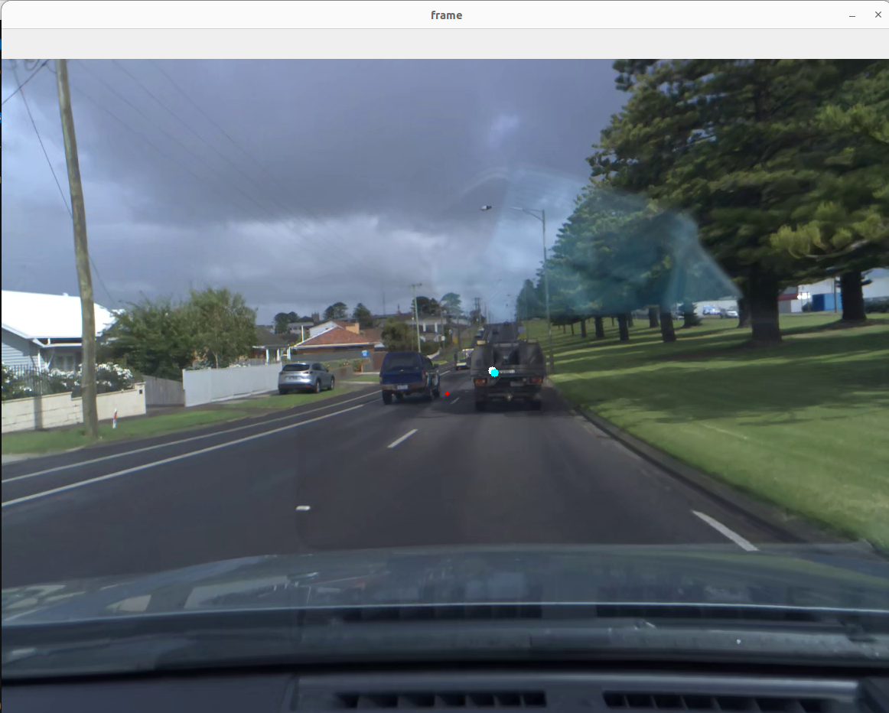

# Pitch and Yaw Estimation using a Monocular SLAM pipeline

## Introduction
 In autonomous vehicles that use cameras, the camera is not exactly aligned with the vehicle. There is some pitch and yaw angle between the camera and the vehicle, which can vary between installations. Estimating these angles is essential for accurate control of the vehicle. Hence in this project, a SLAM pipeline has been implemented to estimate the direction of travel (pitch and yaw). There are 5 videos in the labeled/ directory. Each video is also associated with a txt files tat consists of the pitch and yaw value for each frame of the video. The objective is to estimate the pitch and yaw values and evaluate the results using the eval.py file.

 

  

 ## Approach

 * Use a semantic segmentation network (DeeplabV3) to mask regions within frames that contain dynamic objects (other vehicles, motorbike, etc.)

 

  

 
* Find feature points in one frame and use Lucas-Kanade Optical Flow method, to estimate the displacement and direction of motion onto the next frame.

 

  

* Estimate Essential matrix between consecutive frames
* Recover Pose and from that, the pitch and yaw in camera frame.

  

 

 The blue dot is the estimated direction of travel as seen in image coordinates and the white dot is the actual direction of travel as seen in image coordinates.
 

## Requirements

To run the program, the system needs to have certain libraries installed:

* pytorch
* torchvision
* numpy
* opencv

To run the program, just run the monocula_slam.py file using command **./monocular_sam.py {video_file} {--show}**.
For example to run the algorithm on 0.hevc: **./monocular_slam.py 0 --show**

